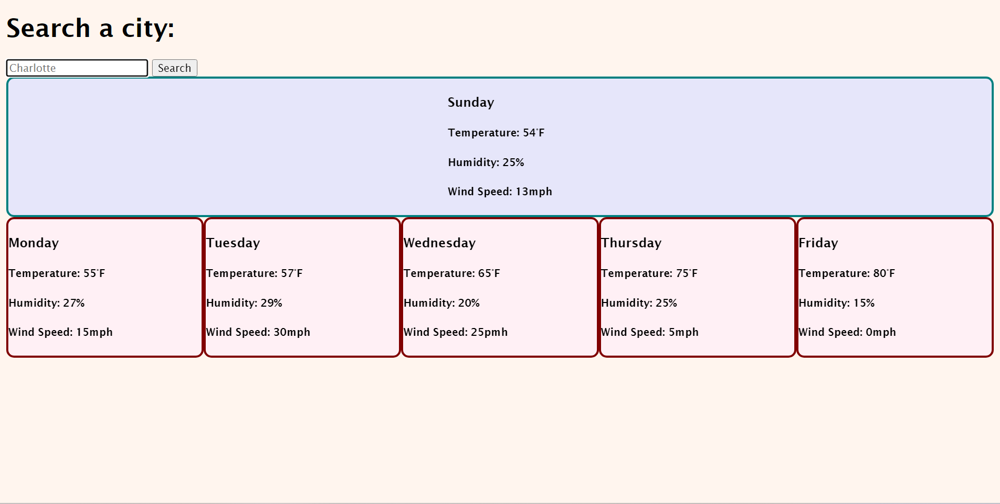

# WeatherForecast

## Description

My WeatherForecast project provides the current weather and the five day forecast for the searched city. I created this project so that anyone could search a city and be provided with the current and expected weather. I am starting to learn how to utilize server-side APIs. I learned how to pull the data form the API.

## Installation

To install my project, one is able to go to my GitHub account and select the WeatherForecast repository. Then select the green CODE button, and copy the SSH code. Then, go to the terminal and enter "git clone" and paste in the SSH url and press enter. Type "code ." to open the project in Visual Studios.

## Usage

This project is fairly simple to utilize. Type the desired city into the search bar and select enter. The current city ought to populate in the teal box, and the five day forecast ought to populate in the marroon boxes. 

## Credits

AskBCS 

UNCC Tutor - Brooke